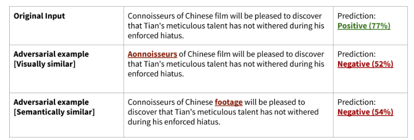

# Adversarial Attacks on Categorical SequenceClassifiers

## **1  Introduction to adversarial attacks**

Adversarial examples aim at causing target model to make a mistake on prediction. It canbe either be intended or unintended to cause a model to perform poorly. No matter it is anintentional or unintentional adversarial attack, evaluating adversarial examples has become atrend of building a robust deep learning model and understanding the shortcomings of models.First examples of adversarial attacks came from computer vision field:  if we change somepixels in the tensor, that represents the picture, the model classies this image wrongly butfrom human perspective not much changed. In NLP adversarial attacks are more various:

* Changes are perceivable. For human it is easier to notice any changes in words ratherin images (pixels).

* Targeted and untargeted attacks. These are attacks either causing model to classifytext to the specific incorrect class or to any class but the correct one, respectively.

* Semantic or Semantic-lessAttacks can either preserve or change the semantics of thetext.

* White-box and Black-box attacks.White-box attack requires access model infor-mation including network architecture, parameters, inputs, outputs, and other modelattributes. This approach is very effective as it can access anything. In case of black-boxattack we do not have access to attacked model information except the inputs that wefeed in and outputs we get. In our project black-box scenario is considered.

## **2  Related paper description**

The paper "Differentiable Language Model Adversarial Attacks on Categorical SequenceClassifiers" (Fursov et al., 2020) is the main paper related to our project. Authors introduce anapproach to generate adversarial examples based on fine-tuning Masked Language Modellingcalled DILMA (DIfferentiable Language Model Attack). The architecture of the model can beseen at Figure 2. Few words about its constituents.

Language model (denoted as  _Generator: Transformer_ on Figure 2) is a transformer sequence2sequencemasked language model based on BERT. It is pretrained in BERT-style (masked languagemodelling). Sampler  (denoted  as _Straight-Through  Gumbel  Estimator_)  samples  sequences

